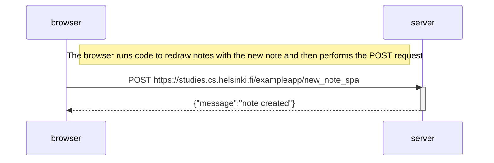

```mermaid
sequenceDiagram
    participant browser
    participant server


    Note right of browser: The browser runs code to redraw notes with the new note and then performs the POST request

    browser->>server: POST https://studies.cs.helsinki.fi/exampleapp/new_note_spa
   activate server
    server-->>browser: {"message":"note created"}
    deactivate server


```